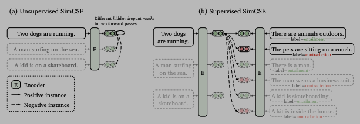
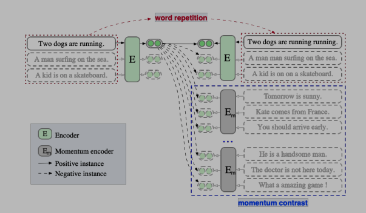

## sentence_representation_matching

该项目主要是文本匹配相关模型，包含使用SimCSE、ESimCSE、PromptBert三种无监督文本匹配模型和SBert、CoSent两种有监督文本匹配模型。


### 无监督文本匹配

#### 1. SimCSE

利用Transformer Dropout机制，使用两次作为正样本对比，以此来拉近正样本，推开负样本。

##### 模型结构：




##### 损失函数：


##### 模型效果：

| data  | Pertained                   |   Pool_type    | Dropout | Batch_size | Dev_corr | Test_corr                            |
| :---- | :-------------------------- | :------------: | :-----: | :--------: | -------- | ------------------------------------ |
| STS-B | hfl/chinese-bert-wwm-ext    | avg_first_last |   0.1   |     64     | 0.76076  | 0.70924                              |
| STS-B | hfl/chinese-bert-wwm-ext    | avg_first_last |   0.2   |     64     | 0.75996  | <font color='red'>**0.71474**</font> |
| STS-B | hfl/chinese-bert-wwm-ext    | avg_first_last |   0.3   |     64     | 0.76518  | 0.71237                              |
| STS-B | hfl/chinese-roberta-wwm-ext | avg_first_last |   0.1   |     64     | 0.75933  | 0.69070                              |
| STS-B | hfl/chinese-roberta-wwm-ext | avg_first_last |   0.2   |     64     | 0.76907  | <font color='red'>**0.72410**</font> |
| STS-B | hfl/chinese-roberta-wwm-ext | avg_first_last |   0.3   |     64     | 0.77203  | 0.72155                              |

参考：

1）https://github.com/princeton-nlp/SimCSE

2）https://github.com/KwangKa/SIMCSE_unsup

3）https://arxiv.org/pdf/2104.08821.pdf


#### 2. ESimCSE

在SimCSE的基础上，通过重复句子中部分词组来构造正样本，同时引入动量对比来增加负样本。

##### 模型结构：




##### 损失函数：


##### 模型效果：

| data  | Pertained                   | Dup_rate | Queue_num |   Pool_type    | Dropout | Batch_size | Dev_corr | Test_corr                             |
| ----- | :-------------------------- | -------- | --------- | :------------: | ------- | :--------: | -------- | ------------------------------------- |
| STS-B | hfl/chinese-bert-wwm-ext    | 0.2      | 32        | avg_first_last | 0.1     |     64     | 0.77274  | 0.69639                               |
| STS-B | hfl/chinese-bert-wwm-ext    | 0.2      | 32        | avg_first_last | 0.2     |     64     | 0.77047  | 0.70042                               |
| STS-B | hfl/chinese-bert-wwm-ext    | 0.2      | 32        | avg_first_last | 0.3     |     64     | 0.77963  | <font color='red'>**0.72478**</font>  |
| STS-B | hfl/chinese-roberta-wwm-ext | 0.3      | 64        | avg_first_last | 0.1     |     64     | 0.77508  | 0.7206                                |
| STS-B | hfl/chinese-roberta-wwm-ext | 0.3      | 64        | avg_first_last | 0.2     |     64     | 0.77416  | 0.7096                                |
| STS-B | hfl/chinese-roberta-wwm-ext | 0.3      | 64        | avg_first_last | 0.3     |     64     | 0.78093  | <font color='red'> **0.72495**</font> |

参考：https://arxiv.org/pdf/2109.04380.pdf


#### 3. PromptBert

使用Prompt方式来表征语义向量，通过不同模板产生的语义向量构造正样本，同一批次中的其他样本作为负样本。

##### 损失函数：


```
本实验使用两个句子模板：
1）[X]，它的意思是[MASK]。
2）[X]，这句话的意思是[MASK]。

在计算损失函数时为了消除Prompt模板影响，通过替换模板后的句子[MASK]获取的表征减去模板中[MASK]获取的表征来得到句子向量表征。
```


##### 模型效果：

| data  | Pertained                   | Pool_type | Dropout | Batch_size | Dev_corr | Test_corr                            |
| ----- | :-------------------------- | :-------: | ------- | :--------: | -------- | ------------------------------------ |
| STS-B | hfl/chinese-bert-wwm-ext    |  x_index  | 0.1     |     32     | 0.78216  | <font color='red'>**0.73185**</font> |
| STS-B | hfl/chinese-bert-wwm-ext    |  x_index  | 0.2     |     32     | 0.78362  | 0.73129                              |
| STS-B | hfl/chinese-bert-wwm-ext    |  x_index  | 0.3     |     32     | 0.76617  | 0.71597                              |
| STS-B | hfl/chinese-roberta-wwm-ext |  x_index  | 0.1     |     32     | 0.79963  | <font color='red'>**0.73492**</font> |
| STS-B | hfl/chinese-roberta-wwm-ext |  x_index  | 0.2     |     32     | 0.7764   | 0.72024                              |
| STS-B | hfl/chinese-roberta-wwm-ext |  x_index  | 0.3     |     32     | 0.77875  | 0.73153                              |

参考：https://arxiv.org/pdf/2201.04337.pdf


#### 4. 模型对比

通过各组对比试验，并挑选模型最优测试集结果展示如下。

| Model      | Pertained-Bert | Pretrained-Roberta |
| ---------- | :------------: | :----------------: |
| SimCSE     |    0.71474     |      0.72410       |
| ESimCSE    |    0.72478     |      0.72495       |
| PromptBERT |    0.73185     |      0.73492       |


### 有监督文本匹配

#### 1. SBert

使用双塔式来微调Bert，MSE损失函数来拟合文本之间的cosine相似度。

模型结构：


参考：https://www.sbert.net/docs/training/overview.html


#### 2. CoSent

构造一个排序式损失函数，即所有正样本对的距离都应该小于负样本对的距离，具体小多少由模型和数据决定，没有一个绝对关系。

损失函数：


参考：

1）https://spaces.ac.cn/archives/8847

2）https://github.com/shawroad/CoSENT_Pytorch
